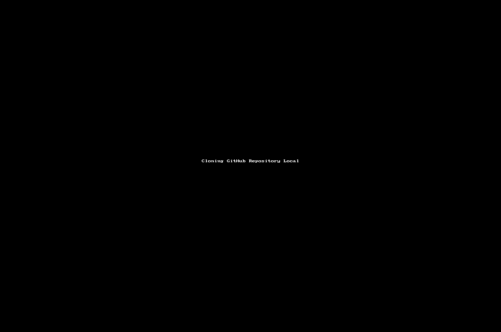

I have been fortunate enough to be given an opportunity to help colleagues at my workplace on their journey to HashiCorp Terraform Associate Certification.

As part of the training track being put together (Mostly centred around the great Pluralsight training material from Ned Bellavance) it seemed a demonstration of some of the capabilities of Terraform would be beneficial for those on their learning journey. I decided to write this article as it will supplement the live demo I will be performing on one of the training sessions and may be of use to anyone else on their journey. This article concentrates on source control which is a good start point for any project.

Scope
-----

The demo will focus on delivering the below target architecture;



We will build the deployment as follows;

*   Start with the AWS provider and a local state
*   Use a module from the terraform registry to define the network components. These include;
    *   VPC
    *   Private and Public Subnets
    *   Internet Gateway
    *   Nat Gateway
    *   Route tables
*   Use a module from the terraform registry to define the Security Groups
*   Create our own module to define an ec2 instance profile for Systems Manager access - Removes the need for a bastion
*   Create our own ec2 instance module utilising templatefiles for the user data
*   Deploy and configure a Prometheus server in the private subnet, scrapping itself
*   Deploy and configure a NGINX server in the public subnet with reverse proxy rule to rewrite traffic to the Prometheus server in the private subnet
*   Add the Azure provider
*   Setup the components in Azure to utilise remote state
    *   Resource Group
    *   Storage Account
    *   Container
    *   SAS Token
*   Move to the remote state

Requirements
------------

I will not be covering the installation of the tools required for this demo but the following outlines my demo environment and the links I used for the component installations;

*   WSL2 running on Windows 10 using Ubuntu 20.04.2 LTS
*   AWS cli version 2.1.32 -- [link](https://docs.aws.amazon.com/cli/latest/userguide/install-cliv2-linux.html)
*   Azure cli version 2.21.0 -- [link](https://docs.microsoft.com/en-us/cli/azure/install-azure-cli-linux?pivots=apt)
*   Terraform 0.14.9 -- [link](https://www.terraform.io/docs/cli/install/apt.html)

Version Control
---------------

We start where all project should , version/source control. This provides a mechanism to share our code (collaboration) and version control just in case we get it wrong. It's a demo, anything can happen :) Here are the high level steps;

1.  Register an account on GitHub
2.  Setup a personal access token for authentication from your client
3.  Create a new repository in your account
4.  Clone the repository to your local machine

As I already have an account on GitHub I will jump straight to step 2

### Personal access tokens

You used to be able to authenticate using your account password for GitHub but they are/have sensibly moving/moved to using more secure authentication methods. For this demo we will be utilising the "personal access token" based authentication.

To create a token you need to open your account settings (click on the picture and select settings) and then navigate to the "Developer settings" option.

In here you can select "Personal access tokens" and then "Generate new token"



The next page will ask a lot of question which define the scope for the token. It's up-to you but I will be defining the following; (principle of least privilage)



Generate Personal Access Token

When you have defined your scope, press the generate token button. You will now be shown the token you can use when authenticating with your git repository.



You should also receive an email from GitHub advising a new token has been created. Extra layer of security! Nice.

### Creating the GitHub repository

Next off we will be creating our new repository under our GitHub account. This will be used to store our source code and commit all our updates.

From within GitHub, login to your account and press



Define your repository settings and then press



My repo was made public and I initialised it with;

*   A README file
*   A .gitignore file
    *   using the Terraform template



You should now have a new repository with a .gitignore (Terraform ready!) and a README.md



Next up we should setup our workstation to clone the repository and sort that README file out. If you are unfamiliar with the markdown format used in the README file, please check [this](https://guides.github.com/features/mastering-markdown/) link out.

### Cloning

We are not referring to the cloning of individuals with identical DNS but something similar. We are going to create a clone of the GitHub repository we created above to our local (WSL2 in my case) desktop. We can then make changes, add new files etc. and push it all back up-to GitHub.

login to your console and navigate to a folder you plan to use for your development;

```bash
dave@HAL9000:~$ cd scripts/training/
dave@HAL9000:~/scripts/training$ mkdir demo1
dave@HAL9000:~/scripts/training$ git clone https://github.com/daveihart/tf-training-demo1.git demo1
Cloning into 'demo1'...
remote: Enumerating objects: 4, done.
remote: Counting objects: 100% (4/4), done.
remote: Compressing objects: 100% (3/3), done.
remote: Total 4 (delta 0), reused 0 (delta 0), pack-reused 0
Unpacking objects: 100% (4/4), 995 bytes | 995.00 KiB/s, done.
dave@HAL9000:~/scripts/training$ cd demo1
dave@HAL9000:~/scripts/training/demo1$ ll
total 20
drwxr-xr-x 3 dave dave 4096 Mar 26 13:41 ./
drwxr-xr-x 3 dave dave 4096 Mar 26 13:41 ../
drwxr-xr-x 8 dave dave 4096 Mar 26 13:41 .git/
-rw-r--r-- 1 dave dave  716 Mar 26 13:41 .gitignore
-rw-r--r-- 1 dave dave   45 Mar 26 13:41 README.md
```

You will notice that we were not prompted to authenticate at any point during the cloning process, this is due to us defining the repository as public. A Private repository would have prompted for credentials. We will get to use the token once we try push any changes.

Next off we will launch visual studio code ([vscode](https://docs.microsoft.com/en-us/windows/wsl/tutorials/wsl-vscode)) to update the README.md

```bash
dave@HAL9000:~/scripts/training/demo1$ code .
Updating VS Code Server to version 622cb03f7e070a9670c94bae1a45d78d7181fbd4
Removing previous installation...
Installing VS Code Server for x64 (622cb03f7e070a9670c94bae1a45d78d7181fbd4)
Downloading: 100%
Unpacking: 100%
Unpacked 1769 files and folders to /home/dave/.vscode-server/bin/622cb03f7e070a9670c94bae1a45d78d7181fbd4.
```

Once vscode has launched (mine needed an update) we open the README.md and update the contents. Here is one I prepared earlier;

```markdown
# terraform-certification-demo1

## Details
As part of an external certification program this demo has been created to help colleagues obtain Hashicorp Terraform associate certification

## Deployment details
The demonstration will deploy the following using Terraform

1. Setup a VCS (git - this is not using terraform but it can be and maybe included at a later date when I work it out)
2. AWS Components (aws provider)
    1. VPC
	2. Private and Public Subnets
	3. Internet Gateway
	4. Nat Gateway
	5. Route tables
    6. Security Groups
    7. Instance profile
    8. IAM Policy
    9. Deploy and configure a Prometheus server in the private subnet
    10. Deploy and configure a NGINX server with reverse proxy rule to access the Prometheus server in the public subnet
3. Azure components
    1. Create a resource group
    2. Create a storage account
    3. Setup blob storage
	4. crete a container for holding the state file
4. Utilise the Azure container for Terraform remote state

### Known issues
None

### Planned enhancements
None presently

## Author
**Dave Hart**
[link to blog!](https://davehart.co.uk)
```

Save the file and jump back to the console. Now we will update the GitHub repository with the changes. We will now be asked to authenticate, use the token as your password.

```bash
dave@HAL9000:~/scripts/training/demo1$ git add README.md
dave@HAL9000:~/scripts/training/demo1$ git commit -m "updating the readme file to reflect the demo deployment"
[main e116fb8] updating the readme file to reflect the demo deployment
 1 file changed, 36 insertions(+), 2 deletions(-)
 rewrite README.md (100%)
dave@HAL9000:~/scripts/training/demo1$ git push
Username for 'https://github.com': daveihart@hotmail.com
Password for 'https://daveihart@hotmail.com@github.com':
Enumerating objects: 5, done.
Counting objects: 100% (5/5), done.
Delta compression using up to 6 threads
Compressing objects: 100% (3/3), done.
Writing objects: 100% (3/3), 916 bytes | 916.00 KiB/s, done.
Total 3 (delta 0), reused 0 (delta 0)
To https://github.com/daveihart/tf-training-demo1.git
   b60fbe6..e116fb8  main -> main
dave@HAL9000:~/scripts/training/demo1$
```

If we refresh the GitHub repository the README should update to reflect the changes we just made.



snippet of the GitHub repository

Below is a small video showing the above steps;



Caching credentials
-------------------

Once you start pushing changes in anger the constant authentication prompt will slow you down. You can try this;

Before a push;

**git config --global credential.helper store**

Push your changes;

After the push;

**git config --global credential.helper cache**

I don't mind this type of cache as its only for the current session (in memory).

Conclusion
----------

We have now laid the foundation for the rest of the demo. We can update the repository as we write and update our code. It's not only held on our local machine, it's visible to others and version controlled. This is the first important step in your code creation and deployment.

[Link](https://github.com/daveihart/tf-training-demo1) to GitHub repository

In [part 2](/post/terraform-multi-cloud-demo-part-2-terraform-remote-state-on-azure/) we can start writing some Terraform code....